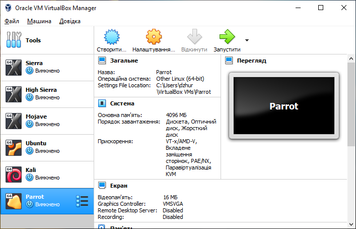
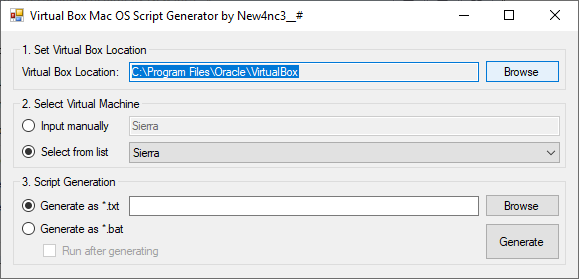
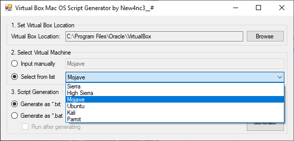
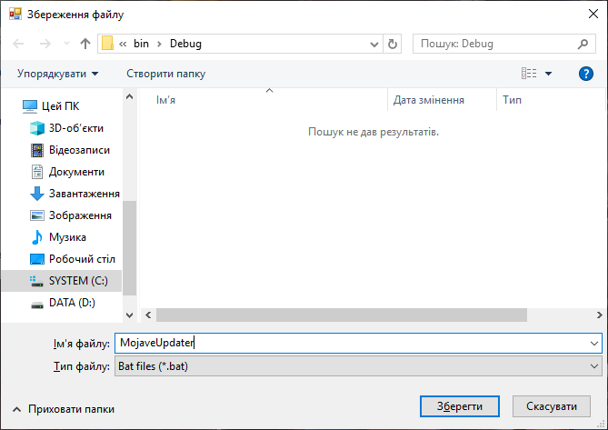
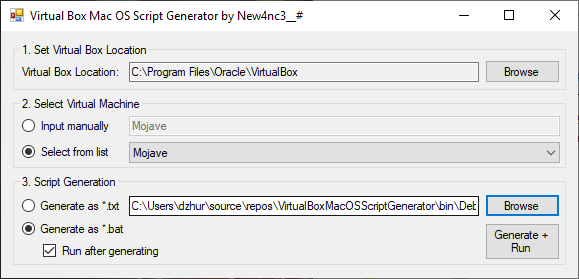
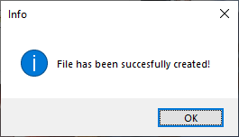
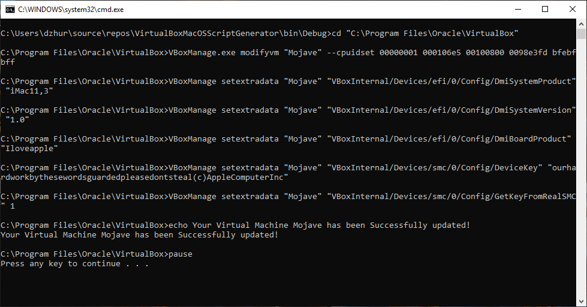

# MacOS Virtual Box Script Generator
This project (small utility) is dedicated for people who want to create Mac OS Virtual Machine using Virtual Box.

As you now, before running Sierra / High Sierra / Mojave / Catalina (not tested yet) on Virtual Box, you should run next commands from Command Line (in some cases with Admin rights):

  cd "C:\Program Files\Oracle\VirtualBox\"

  VBoxManage.exe modifyvm "VM_NAME" --cpuidset 00000001 000106e5 00100800 0098e3fd bfebfbff

  VBoxManage setextradata "VM_NAME" "VBoxInternal/Devices/efi/0/Config/DmiSystemProduct" "iMac11,3"

  VBoxManage setextradata "VM_NAME" "VBoxInternal/Devices/efi/0/Config/DmiSystemVersion" "1.0"

  VBoxManage setextradata "VM_NAME" "VBoxInternal/Devices/efi/0/Config/DmiBoardProduct" "Iloveapple"

  VBoxManage setextradata "VM_NAME" "VBoxInternal/Devices/smc/0/Config/DeviceKey" "ourhardworkbythesewordsguardedpleasedontsteal(c)AppleComputerInc"

  VBoxManage setextradata "VM_NAME" "VBoxInternal/Devices/smc/0/Config/GetKeyFromRealSMC" 1

So, this utility extract Virtual Machines list from your Virtual Box and generate *.txt or *.bat file (you also can execute this bat to apply commands). 

In this example, I have next Virtual Machines on my laptop in Virtual Box:

You can see example of using utility below.

1) (Optionally) Select your own Virtual Box location or leave it alone if you have default instead:

2) Select Virtual Machine name by checking radiobutton "Input manually" or "Select VM from list", if you've correct location of VB in 1)

3) Pick "Generate as *.txt" or "Generate as *.bat" if you want to get a script (you can pick checkbox "Run after generating" as well). Next, click "Browse" button and input name and location where the script should be

4) Click "Generate" and that's it! Program has notify you about successfully script generation procedure completing

And, if you've checked "Run after generating", you will see something like this:

I hope it helps anyone with getting started in Mac on VM.

Good Luck!
